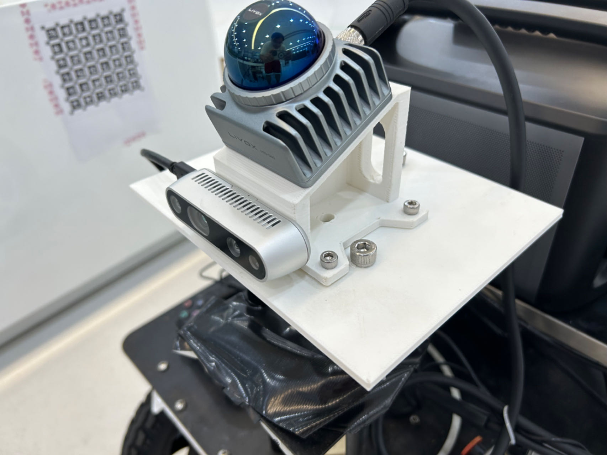
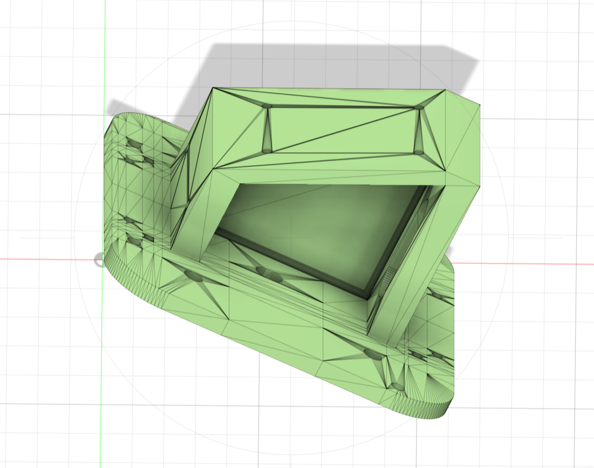
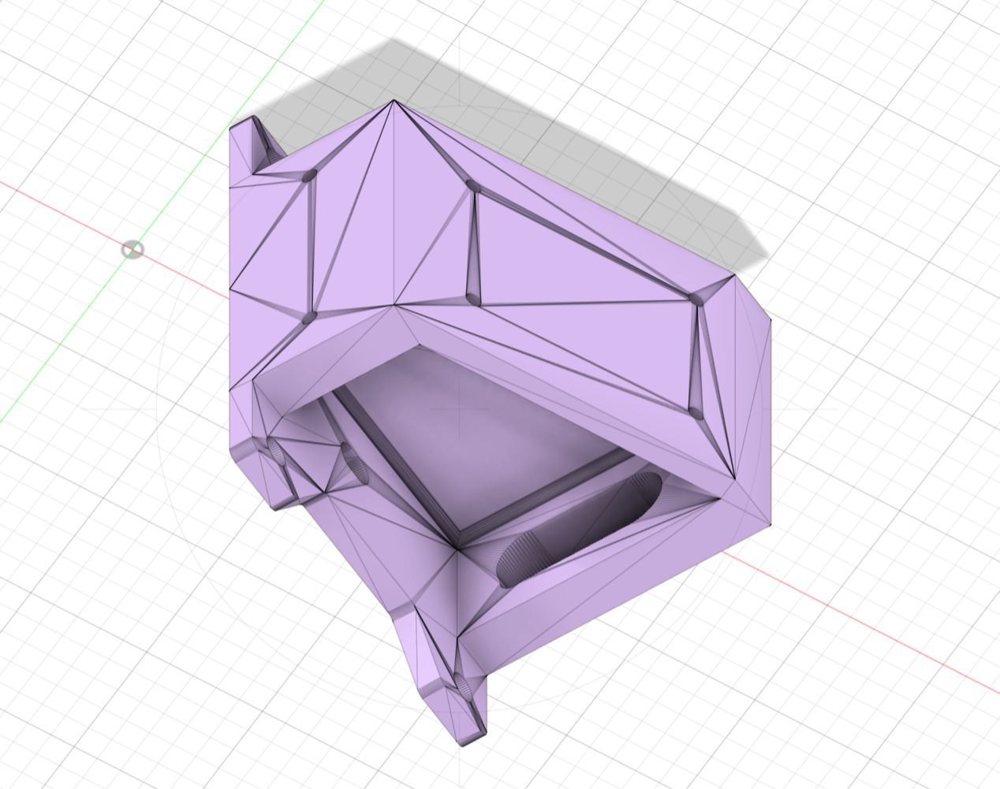

# Camera-LiDAR-Joint-Device

- Camera: Intel realsense D435i
- LiDAR: Mid-360
- LIDAR tilt angle: 25°

Download links for all .step and .stl files:

[https://drive.google.com/drive/folders/1joyl-LemxTImnbqVTSZiHiYjeqUCuGFM?usp=drive_link](https://drive.google.com/drive/folders/1joyl-LemxTImnbqVTSZiHiYjeqUCuGFM?usp=drive_link)

## Images

Note: This device was designed by my friend Haoyuan ZHANG, and I paid for a meal in return.