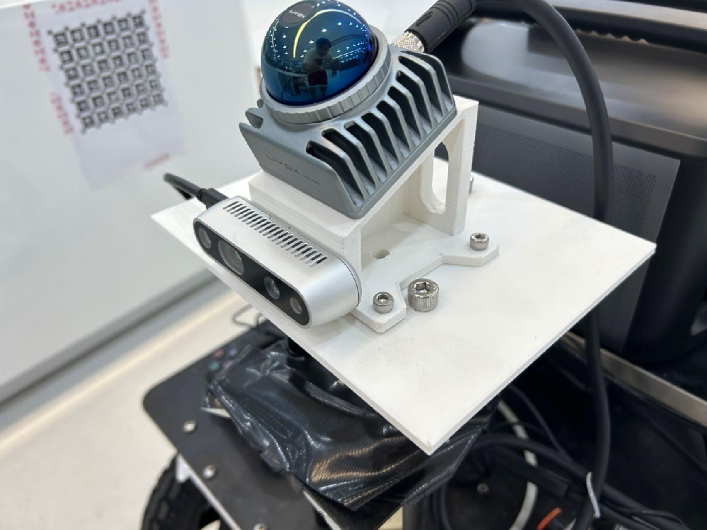
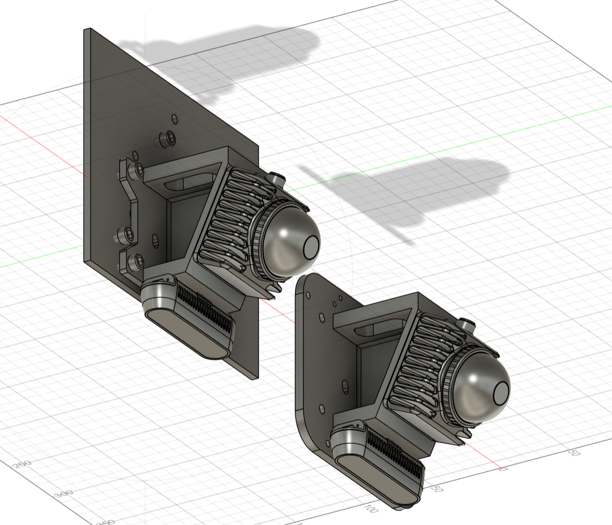
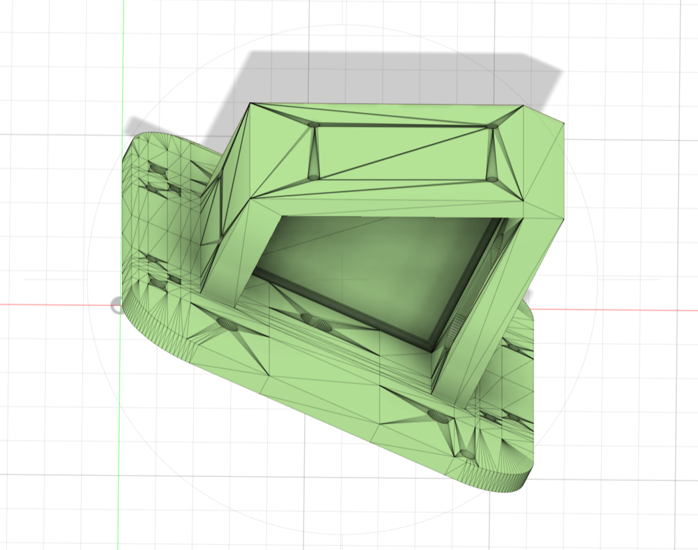
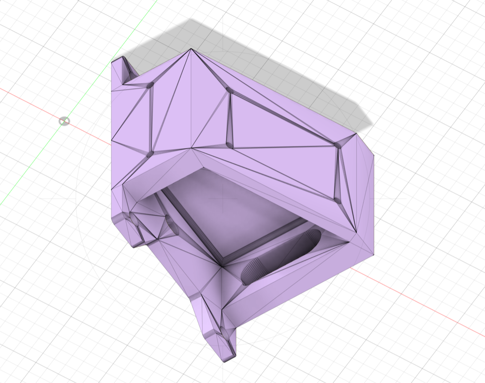
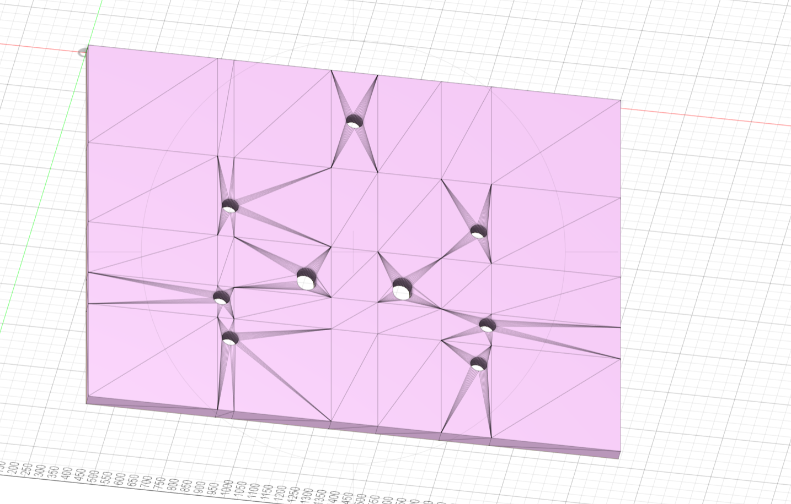

# Camera-LiDAR-Joint-Device

- Camera: Intel realsense D435i
- LiDAR: Mid-360
- LIDAR tilt angle: 25°

Download links for all .step and .stl files:

[https://drive.google.com/drive/folders/1joyl-LemxTImnbqVTSZiHiYjeqUCuGFM?usp=drive_link](https://drive.google.com/drive/folders/1joyl-LemxTImnbqVTSZiHiYjeqUCuGFM?usp=drive_link)

## Images











## License

Free!

Note: This device was designed by my friend Haoyuan ZHANG, and I paid for a meal in return.

## Citation

This project is part of [UMAD](https://github.com/IMRL/UMAD). If you find this work useful, please consider citing the paper:

```
@article{li2024umad
  author    = {Li, Dong and Chen, Lineng and Xu, Cheng-Zhong and Kong, Hui},
  title     = {UMAD: University of Macau Anomaly Detection Benchmark Dataset},
  journal   = {arXiv preprint arXiv:2408.12527},
  year      = {2024},
}
```
